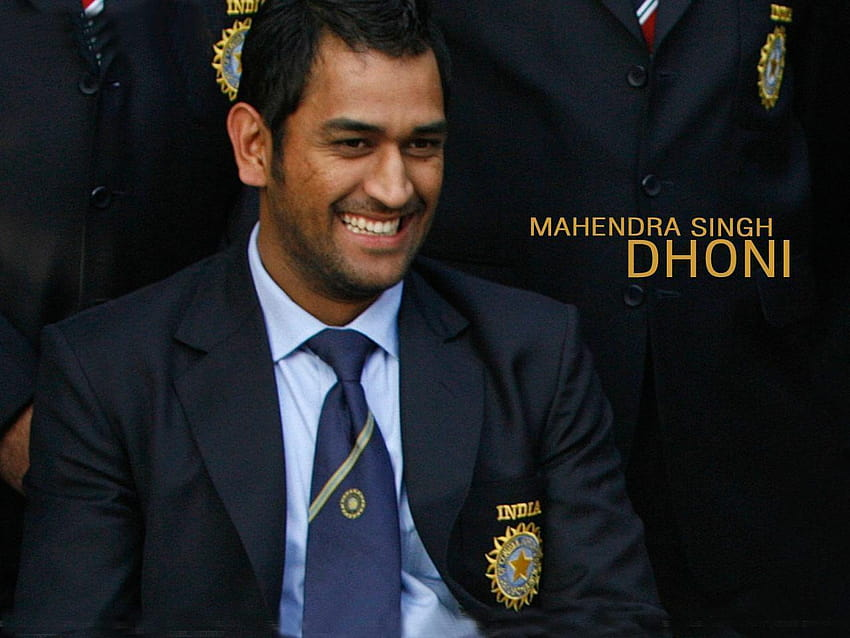

# Learning
My Repository to understand Life Better

-- To move Forward in life
- Good Listener
- Self Respect
- Character Building Strong
- Value System
- Focus
- No Distraction
- Purpose of Doing Thing (Why are you doing this thing to achieve?) 
- Sacrifice

-- Travel and create stuff for my own happiness. Smile your way whether you win or loose

-- You know the whole thing about life is you want to find those few good people that become part of your life that make you happy.

# New way to start my Morning
# Bad Way

# Good Way

# Priority
-- Be with someone who Prioritizes you, no matter how busy they are, rather than giving excuses, "they find ways to be with you".

-- Be with someone who believes in your dreams, goals and constantly pushes me to work harder. "Its better to be alone than with wrong partner".

---
## If four things are followed having a great aim, acquiring knowledge, hardwork and perseverance - then anything can be achieved.

---

Happy Birthday Mahi☺️

<table>
<tr>
<td></td>
<td></td>
</tr>
</table>

---
- If Ira raining heavily you can't run away from it. 
- You will get wet.
- So either you look for some shade.
-- Or tell yourself "I will get wet. But that dosen't mean I won't get dry again."

- Life is like that.
- Replace rain with problems and the approach remains the same.